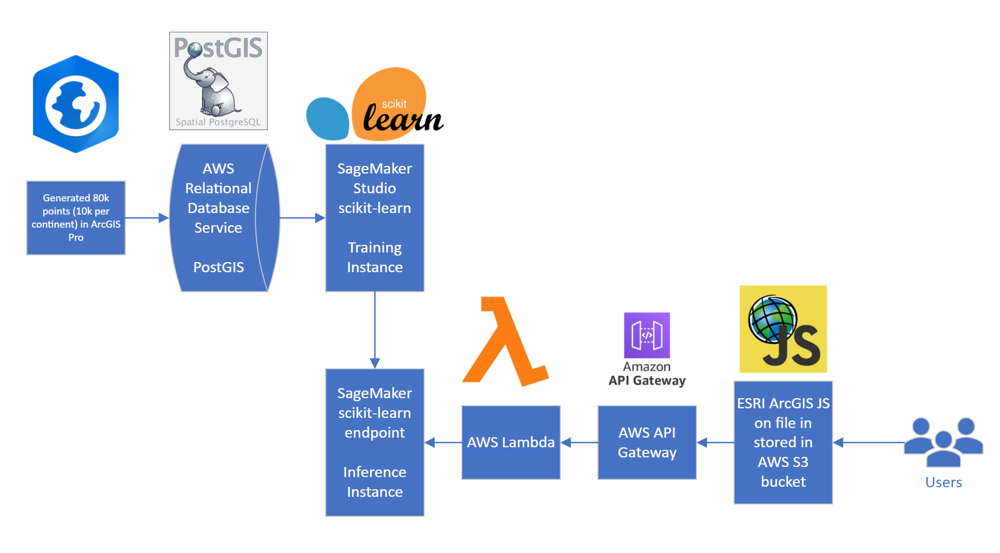
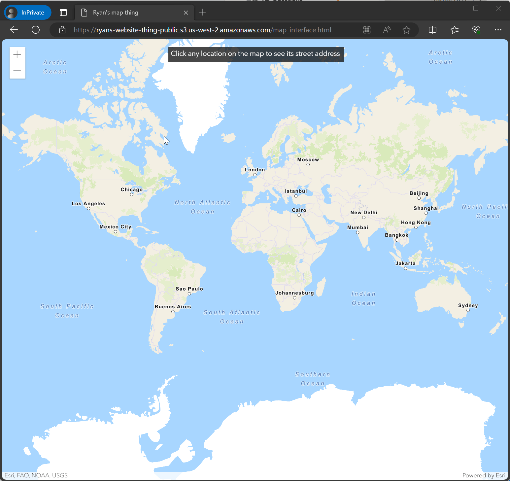

# Geospatial Machine Learning "Hello World" - a personal project

(Future Ryan here, post AWS ML cert: this is not architected correctly! Oh well!)

Model accuracy was not a priority for this project - it was more of a race to deployment and having a working interface. The endpoint was up for a week and was yanked - hence no live clicky map. Serverless deployments are pretty cool from what I hear.

Who actually reads this stuff? Any way I am flattered that you are here to begin with and you should totally add me on LinkedIn. I don't bite! I swear!

This is my vision of what a Geospatial Machine Learning "Hello World" would look like. A simple model that predicts what continent a given longitude/latitude pair lies on. Because I am learning AWS and enjoy pain I am pulling 80k points generated in ArcGIS from a PostGIS database hosted in AWS, and then trying to get the model to connect to an ArcGIS JS front end. Ideally, the users will be able to play with the model by clicking on the map. 

Code is messy, but works (it's a personal project :-D). There is a bunch of AWS config stuff that is not documented here however.

By all means rip this thing off and try to learn something. Let me know how it goes or if you get stuck.
